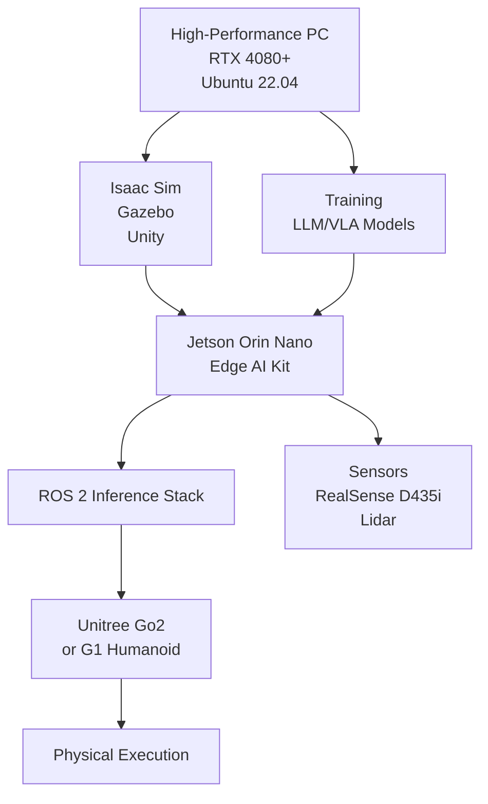

# Hardware Requirements and Lab Setup

## Introduction

This chapter addresses the critical hardware infrastructure required for implementing Physical AI and humanoid robotics systems. Hardware selection significantly impacts system capabilities, performance, and the feasibility of sim-to-real transfer. We'll explore requirements at various levels, from computational hardware to actual robots.

## Technical Demands of Physical AI

### Computational Requirements

Physical AI sits at the intersection of three computationally intensive domains:

1. **Physics Simulation**: Gazebo, Isaac Sim, and Unity require significant GPU resources for real-time physics and rendering
2. **Visual Perception**: SLAM, computer vision, and deep learning models demand substantial computational power
3. **Generative AI**: LLMs and Vision-Language-Action models require powerful hardware for inference

### System Architecture Overview

The typical Physical AI system requires:

```
┌─────────────────┐    ┌─────────────────┐    ┌─────────────────┐
│  Simulation     │    │  Perception &   │    │  Generative     │
│  Platform       │    │  Control        │    │  AI (LLMs)      │
│  (Isaac Sim,    │    │  (Isaac ROS,    │    │  (OpenAI API,   │
│   Gazebo)       │    │   Nav2)         │    │   Local LLMs)   │
│  RTX 4080+      │    │  Jetson Orin    │    │  Cloud or       │
│  64GB RAM       │    │  Orin Nano      │    │  High-end PC    │
└─────────────────┘    └─────────────────┘    └─────────────────┘
         │                       │                       │
         └───────────────────────┼───────────────────────┘
                                 ▼
                    ┌─────────────────┐
                    │  Robot Platform │
                    │  (Unitree Go2,  │
                    │   H1, G1)       │
                    │  Custom         │
                    └─────────────────┘
```

## High-Performance Workstations (Sim Rigs)

### Recommended Specifications

For the "Simulated Humanoid" development, high-performance workstations are essential:

**Minimum Requirements:**
- **GPU**: NVIDIA RTX 4080 (16GB VRAM) or equivalent
- **CPU**: 16+ cores, 32+ threads (AMD Ryzen 9 7950X or Intel i9-13900K)
- **RAM**: 64GB DDR5 (128GB recommended for large simulations)
- **Storage**: 2TB NVMe SSD for OS/simulations, additional storage for datasets
- **OS**: Ubuntu 22.04 LTS (optimized for ROS 2 and Isaac)

**Recommended Specifications:**
- **GPU**: NVIDIA RTX 4090 (24GB VRAM) or RTX 6000 Ada
- **CPU**: 24+ cores with high single-thread performance
- **RAM**: 128GB DDR5
- **Storage**: 4TB+ NVMe SSD array
- **Networking**: 10GbE for robot communication

### Workstation Setup

```bash
# Install CUDA toolkit for GPU acceleration
wget https://developer.download.nvidia.com/compute/cuda/12.1.0/local_installers/cuda_12.1.0_530.30.02_linux.run
sudo sh cuda_12.1.0_530.30.02_linux.run

# Install ROS 2 Humble Hawksbill
sudo apt update
sudo apt install software-properties-common
sudo add-apt-repository universe
sudo apt update
sudo apt install ros-humble-desktop
sudo apt install python3-rosdep python3-rosinstall python3-rosinstall-generator python3-wstool build-essential

# Install Isaac ROS dependencies
sudo apt install ros-humble-isaac-ros-* ros-humble-nvblox-*
```

### Optimization for Robotics Simulation

**NVIDIA Driver Optimization:**
```bash
# Optimize GPU for simulation workloads
nvidia-smi -ac 5000,1300  # Adjust clock speeds for consistent performance
sudo nvidia-persistenced  # Keep GPU initialized
```

**System Configuration:**
```bash
# Increase shared memory for large simulations
echo "tmpfs /dev/shm tmpfs defaults,size=8G 0 0" | sudo tee -a /etc/fstab
sudo mount -o remount,size=8G /dev/shm
```

## Edge Computing Kits (Brains without Bodies)

### Jetson Platform Overview

The NVIDIA Jetson series provides powerful edge computing capabilities for robotics:

#### Jetson Orin Nano Super Dev Kit (8GB)
- **GPU**: 1024-core NVIDIA Ampere architecture GPU
- **CPU**: 4-core ARM Cortex-A78AE v8.2 64-bit CPU
- **RAM**: 8GB LPDDR5
- **Performance**: 40 TOPS AI performance
- **Price**: ~$249 (significantly reduced from original pricing)

### Jetson Kit Configuration

```bash
# Flash Jetson with appropriate image
sudo apt install nvidia-jetpack
sudo jetson-flash --image jetson-orin-nx-devkit-emmc --device orin-nx

# Install robotics middleware
sudo apt install ros-humble-ros-base
sudo apt install ros-humble-navigation2 ros-humble-nav2-bringup

# Install Isaac ROS packages
sudo apt install ros-humble-isaac-ros-* ros-humble-nvblox-*
```

### Performance Optimization on Jetson

```python
# Optimize for real-time performance
import jetson_utils

# Set GPU to maximum performance mode
jetson_utils.cuda_set_device(0)
jetson_utils.cuda_device_set_power_profile(0, jetson_utils.CUDA_POWER_PROFILE_MAXIMUM)

# Monitor thermal performance
def check_thermal_throttling():
    with open('/sys/devices/virtual/thermal/thermal_zone1/temp', 'r') as f:
        temp = int(f.read()) / 1000.0
        if temp > 85:
            print(f"Warning: Temperature {temp}°C - thermal throttling may occur")
```

## Sensor Integration

### Primary Sensors for Physical AI

#### Intel RealSense D435i
- **RGB Camera**: 1920×1080 @ 30Hz
- **Depth Camera**: Up to 16000×1200 @ 90Hz
- **IMU**: Built-in gyroscope and accelerometer
- **Connectivity**: USB 3.0 Type-C

```bash
# Install RealSense drivers and ROS 2 wrapper
sudo apt install ros-humble-realsense2-camera ros-humble-realsense2-description
sudo apt install librealsense2-dev librealsense2-utils
```

#### LiDAR Sensors
For navigation and mapping:
- **Recommended**: Ouster OS0-64M or Velodyne VLP-16
- **Budget Alternative**: Slamtec RPLidar A3
- **Integration**: ROS 2 navigation stack compatibility

#### Audio Interface
- **ReSpeaker USB Mic Array v2.0**: Far-field microphone for voice commands
- **Integration**: USB audio class compliant for ROS 2

## Robot Platforms

### Option A: The "Proxy" Approach (Recommended for Budget)

#### Unitree Go2 Edu
- **Price**: ~$1,800 - $3,000
- **Features**:
  - Quadruped robot with excellent ROS 2 support
  - 2 hours battery life
  - IP65 water resistance
  - SDK with Python/C++ interfaces

**Advantages:**
- Highly durable for development
- Excellent ROS 2 support
- Affordable enough for multiple units
- Proven in research applications

**Limitations:**
- Not a biped (humanoid)
- Limited manipulation capabilities

### Option B: The "Miniature Humanoid" Approach

#### Unitree G1 (~$16k)
- **Height**: 100cm
- **Weight**: 22kg
- **DoF**: 32
- **Battery**: 2 hours
- **SDK**: Open for development

#### Robotis OP3 (Legacy, ~$12k)
- **Height**: 83cm
- **Weight**: 7.5kg
- **DoF**: 20
- **Open Platform**: Proven but older hardware

#### Budget Alternative: Hiwonder TonyPi Pro (~$600)
- **Limitations**: Runs on Raspberry Pi, limited Isaac ROS compatibility
- **Best for**: Kinematics and basic walking patterns only

### Option C: The "Premium" Lab (Sim-to-Real Specific)

#### Unitree G1 Humanoid
- **Why**: One of few commercially available humanoids with open SDK
- **Capabilities**: Dynamic walking, basic manipulation, programmable
- **Requirements**: Significant investment but enables true humanoid research

## Architecture for Lab Infrastructure

### Recommended Lab Setup



### Component Breakdown

| Component | Model | Function | Notes |
|-----------|-------|----------|-------|
| **Sim Rig** | PC with RTX 4080+ | Runs Isaac Sim, Gazebo, Unity, trains models | 64GB+ RAM recommended |
| **Edge Brain** | Jetson Orin Nano | Runs inference stack | Student kit compatible |
| **Sensors** | RealSense D435i + LiDAR | Feeds data to AI systems | Essential for SLAM |
| **Actuator** | Unitree Go2/G1 | Receives commands from Jetson | Shared in lab setting |

### Lab Cost Breakdown

#### Individual Student Kit (~$700)
- **The Brain**: NVIDIA Jetson Orin Nano Super Dev Kit (8GB) - $249
- **The Eyes**: Intel RealSense D435i - $349
- **The Ears**: ReSpeaker USB Mic Array v2.0 - $69
- **Power/Misc**: SD Card (128GB High-endurance) + accessories - $30
- **Total**: ~$697 per kit

#### Shared Lab Hardware
- **Simulation Rigs**: 2-3 high-end workstations for shared use
- **Robots**: 1-2 Unitree Go2 units for shared testing
- **Network Infrastructure**: Managed switches, access points

## Alternative Deployment Strategies

### When RTX-Enabled Workstations Are Not Available

If RTX-enabled workstations are unavailable, consider restructuring:

#### Cloud-Based Development
- **AWS G5 instances**: A10G GPU with 24GB VRAM
- **Azure ND A100**: For more powerful training
- **Challenges**: Network latency for robot control

#### Hybrid Approach
- **Cloud Simulation**: For training and heavy computation
- **Local Inference**: Deploy trained models to local Jetson kits
- **Robot Interaction**: Direct local robot control to minimize latency

### Cloud Workstation Considerations

**Instance Types:**
- AWS: `g5.2xlarge` (A10G GPU, 24GB VRAM) - ~$1.50/hour
- GCP: `a2-highgpu-1g` (A100 GPU) - Variable pricing
- Azure: `Standard_NC6s_v3` - For budget scenarios

**Cost Calculation Example:**
- Instance cost: ~$1.50/hour
- Usage: 10 hours/week × 12 weeks = 120 hours
- Storage (EBS volumes): ~$25/quarter
- **Total Cloud Bill**: ~$205 per quarter per student

## Integration and Testing

### Hardware Compatibility Testing

```python
# Hardware validation script
import subprocess
import sys

def validate_hardware_setup():
    """Validate hardware setup for Physical AI development"""

    # Check GPU availability
    try:
        result = subprocess.run(['nvidia-smi'], capture_output=True, text=True)
        if result.returncode == 0:
            print("✓ GPU detected and accessible")
        else:
            print("✗ GPU not accessible")
    except FileNotFoundError:
        print("✗ NVIDIA drivers not installed properly")

    # Check ROS 2 installation
    try:
        result = subprocess.run(['ros2', 'topic', 'list'], capture_output=True, text=True)
        print("✓ ROS 2 installed and accessible")
    except FileNotFoundError:
        print("✗ ROS 2 not installed")

    # Check Isaac ROS packages
    try:
        result = subprocess.run(['ros2', 'pkg', 'list'], capture_output=True, text=True)
        if 'isaac_ros' in result.stdout:
            print("✓ Isaac ROS packages installed")
        else:
            print("✗ Isaac ROS packages not found")
    except Exception:
        print("✗ Error checking Isaac ROS packages")

if __name__ == "__main__":
    validate_hardware_setup()
```

### Performance Benchmarking

```python
# Performance benchmarking for robot systems
import time
import psutil
import GPUtil

def benchmark_system():
    """Benchmark system performance for Physical AI workloads"""

    # CPU benchmark
    start_time = time.time()
    # Simulate computational workload
    result = sum(i * i for i in range(1000000))
    cpu_time = time.time() - start_time

    # Memory usage
    memory = psutil.virtual_memory()

    # GPU benchmark
    gpus = GPUtil.getGPUs()
    if gpus:
        gpu = gpus[0]
        print(f"GPU: {gpu.name}, Memory: {gpu.memoryTotal}MB")

    print(f"CPU computation time: {cpu_time:.3f}s")
    print(f"Memory usage: {memory.percent}%")

    return {
        'cpu_time': cpu_time,
        'memory_percent': memory.percent,
        'gpu_name': gpus[0].name if gpus else 'None',
        'gpu_memory': gpus[0].memoryTotal if gpus else 0
    }
```

## Troubleshooting Common Hardware Issues

### GPU Issues
- **Driver Conflicts**: Ensure CUDA toolkit matches GPU driver version
- **VRAM Limitations**: Monitor VRAM usage during simulation
- **Thermal Throttling**: Check cooling system adequacy

### Sensor Integration Problems
- **USB Bandwidth**: RealSense cameras require high USB bandwidth
- **Synchronization**: Ensure proper timing between sensors
- **Calibration**: Regular sensor calibration for accuracy

### Robot Communication Issues
- **Network Latency**: Critical for real-time robot control
- **Packet Loss**: Can cause robot instability
- **Protocol Compatibility**: Ensure ROS 2 version alignment

## The Latency Trap: Sim-to-Real Considerations

### Critical Issue: Network Latency

Controlling real robots from cloud instances is dangerous due to latency:

- **Control Loop Timing**: Robots need &lt;10ms control loop for stability
- **Cloud Latency**: 50-200ms typical cloud-to-robot latency
- **Safety Risk**: High latency can cause robot falls or collisions

### Solution: Train in Cloud, Deploy Locally

```python
# Deployment strategy: cloud training, local execution
def deploy_model_to_jetson():
    """Deploy trained model from cloud to local Jetson"""

    # 1. Train model in cloud simulation
    # 2. Export model weights
    # 3. Transfer to Jetson
    # 4. Load and optimize for Jetson
    # 5. Test with local sensors

    print("Model deployed to local Jetson for low-latency execution")
```

## Summary

This chapter covered:

- Hardware requirements at the intersection of simulation, perception, and AI
- High-performance workstation specifications for simulation
- Jetson edge computing kits for robot deployment
- Sensor integration including RealSense cameras and LiDAR
- Robot platform options from budget proxies to premium humanoids
- Lab infrastructure architecture and cost considerations
- Cloud vs. local deployment strategies
- Hardware validation and troubleshooting

Successful Physical AI implementation requires careful hardware selection and configuration. The investment in proper hardware infrastructure directly impacts the quality of sim-to-real transfer and overall system performance.