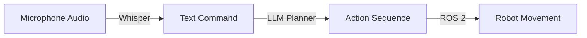

# Module 4: Vision-Language-Action (VLA)

::info
**Focus**: The convergence of Large Language Models (LLMs) and Robotics.
::

## The New Paradigm: From Code to Cognition

Traditional robotics relies on explicit code: "Move to X, Y, Z." VLA models change this by allowing robots to understand natural language: "Clean the room." This chapter explores how we bridge the semantic world of language with the physical world of action.

## 1. Voice-to-Action with OpenAI Whisper

The first step in a VLA pipeline is **hearing**. We use OpenAI's Whisper model to transact spoken commands into text with high accuracy, even in noisy environments.

### The Pipeline


<details>
<summary>Show Implementation Details (Python)</summary>

```python
import openai

def transcribe_audio(audio_file_path):
    with open(audio_file_path, "rb") as audio_file:
        transcript = openai.Audio.transcribe("whisper-1", audio_file)
    return transcript["text"]

# Usage
command = transcribe_audio("command.wav")
print(f"User said: {command}")
```
</details>

## 2. Cognitive Planning with LLMs

Once we have text ("Clean the kitchen"), the robot needs to break this down. An LLM (like GPT-4) acts as the "Prefrontal Cortex," reasoning about the steps.

### Prompt Engineering for Robots
We don't just ask the LLM to "chat." We ask it to output **structured plans**.

**System Prompt:**
> You are a robot planner. Output a JSON sequence of actions. Available actions: [MOVE_TO, GRASP, LIFT, DROP].

**User:** "Pick up the red ball."

**LLM Response:**
```json
{
  "plan": [
    {"action": "MOVE_TO", "target": "red_ball"},
    {"action": "GRASP", "object": "red_ball"},
    {"action": "LIFT", "height": 0.5}
  ]
}
```

<details>
<summary>Show Planner Code</summary>

```python
def generate_plan(user_command):
    # Call OpenAI API with specific system prompt
    # Return parsed JSON plan
    pass
```
</details>

## 3. The Capstone: The Autonomous Humanoid

In the final project, you will combine these elements. A simulated humanoid in Isaac Sim will:
1.  **Listen** to your voice command.
2.  **Plan** a path using Nav2.
3.  **Identify** objects using Computer Vision.
4.  **Manipulate** the object to fulfill the request.

::tip
This convergence is what makes "Physical AI" different from traditional automation. The robot is *reasoning*, not just repeating.
::