# Module 4: Vision-Language-Action (VLA)

> [!IMPORTANT]
> **Focus**: The convergence of Large Language Models (LLMs) and Robotics - the most exciting frontier in Physical AI.

## The New Paradigm: From Code to Cognition

Traditional robotics relies on explicit code: "Move to X, Y, Z." VLA models change this by allowing robots to understand natural language: "Clean the room." This chapter explores how we bridge the semantic world of language with the physical world of action.

### Why VLA Matters


| Approach | Input | Flexibility | Learning |
|----------|-------|-------------|----------|
| Traditional | Explicit coordinates | Low | None |
| VLA | Natural language | High | Continuous |

---

## 1. Voice-to-Action with OpenAI Whisper

The first step in a VLA pipeline is **hearing**. We use OpenAI's Whisper model to transcribe spoken commands into text with high accuracy, even in noisy environments.

### The Complete Pipeline

```mermaid
graph LR
    A[🎤 Microphone] -->|Audio Stream| B[Whisper ASR]
    B -->|Text| C[LLM Planner]
    C -->|Action JSON| D[ROS 2 Bridge]
    D -->|Commands| E[🤖 Robot]
    E -->|Feedback| F[Vision System]
    F -->|State| C
```



### Implementation: Real-Time Speech Recognition

```python
import openai
from openai import OpenAI
import pyaudio
import wave
import tempfile

class VoiceCommandInterface:
    """
    Real-time voice command interface using OpenAI Whisper.
    Captures audio from microphone and transcribes to text.
    """
    
    def __init__(self):
        self.client = OpenAI()
        self.sample_rate = 16000
        self.chunk_size = 1024
        
    def record_audio(self, duration: float = 5.0) -> str:
        """Record audio from microphone and save to temp file."""
        p = pyaudio.PyAudio()
        
        stream = p.open(
            format=pyaudio.paInt16,
            channels=1,
            rate=self.sample_rate,
            input=True,
            frames_per_buffer=self.chunk_size
        )
        
        print("🎤 Listening... Speak your command.")
        frames = []
        
        for _ in range(int(self.sample_rate / self.chunk_size * duration)):
            data = stream.read(self.chunk_size)
            frames.append(data)
        
        stream.stop_stream()
        stream.close()
        p.terminate()
        
        # Save to temporary WAV file
        temp_file = tempfile.NamedTemporaryFile(suffix=".wav", delete=False)
        wf = wave.open(temp_file.name, 'wb')
        wf.setnchannels(1)
        wf.setsampwidth(p.get_sample_size(pyaudio.paInt16))
        wf.setframerate(self.sample_rate)
        wf.writeframes(b''.join(frames))
        wf.close()
        
        return temp_file.name
    
    def transcribe(self, audio_file_path: str) -> str:
        """Transcribe audio file using Whisper."""
        with open(audio_file_path, "rb") as audio_file:
            transcript = self.client.audio.transcriptions.create(
                model="whisper-1",
                file=audio_file,
                language="en"
            )
        return transcript.text
    
    def listen_and_transcribe(self, duration: float = 5.0) -> str:
        """Complete pipeline: record and transcribe."""
        audio_path = self.record_audio(duration)
        command = self.transcribe(audio_path)
        print(f"📝 Transcribed: {command}")
        return command


# Usage Example
if __name__ == "__main__":
    voice = VoiceCommandInterface()
    command = voice.listen_and_transcribe(duration=5.0)
    print(f"User said: {command}")
```

### Handling Noisy Environments

Whisper is robust, but real-world robotics environments are challenging:

```python
def preprocess_audio(audio_path: str) -> str:
    """
    Apply noise reduction before transcription.
    Uses noisereduce library for spectral gating.
    """
    import librosa
    import noisereduce as nr
    import soundfile as sf
    
    # Load audio
    audio, sr = librosa.load(audio_path, sr=16000)
    
    # Apply noise reduction
    reduced_noise = nr.reduce_noise(y=audio, sr=sr)
    
    # Save cleaned audio
    cleaned_path = audio_path.replace('.wav', '_cleaned.wav')
    sf.write(cleaned_path, reduced_noise, sr)
    
    return cleaned_path
```

---

## 2. Cognitive Planning with LLMs

Once we have text ("Clean the kitchen"), the robot needs to break this down. An LLM (like GPT-4) acts as the **"Prefrontal Cortex"**, reasoning about the steps required.

### The Planning Architecture


### Prompt Engineering for Robots

We don't just ask the LLM to "chat." We ask it to output **structured plans** in JSON format that can be directly executed.

```python
from openai import OpenAI
from typing import List, Dict, Any
import json

class RobotPlanner:
    """
    LLM-based robot action planner.
    Converts natural language commands to executable action sequences.
    """
    
    SYSTEM_PROMPT = """You are an expert robot planner for a humanoid robot.
Your task is to convert natural language commands into executable action sequences.

Available Actions:
- MOVE_TO: Move to a location. Params: target (object name or coordinates)
- GRASP: Close gripper on object. Params: object (name), force (0.0-1.0)
- RELEASE: Open gripper. Params: none
- LIFT: Raise grasped object. Params: height (meters)
- LOWER: Lower grasped object. Params: height (meters)
- ROTATE: Rotate end effector. Params: angle (degrees), axis (x/y/z)
- WAIT: Pause execution. Params: duration (seconds)
- LOOK_AT: Direct camera/head. Params: target (object or coordinates)
- SPEAK: Audio output. Params: message (text)

Current Environment Objects: table, chair, red_ball, blue_cup, door, trash_bin

Rules:
1. Always verify object location with LOOK_AT before MOVE_TO
2. Approach objects before grasping
3. Lift objects before moving with them
4. Include safety checks for human presence

Output Format: JSON with "plan" array of action objects."""

    def __init__(self):
        self.client = OpenAI()
        self.model = "gpt-4o-mini"
    
    def generate_plan(self, command: str, context: Dict[str, Any] = None) -> List[Dict]:
        """Generate action plan from natural language command."""
        
        user_message = f"Command: {command}"
        if context:
            user_message += f"\nContext: {json.dumps(context)}"
        
        response = self.client.chat.completions.create(
            model=self.model,
            messages=[
                {"role": "system", "content": self.SYSTEM_PROMPT},
                {"role": "user", "content": user_message}
            ],
            response_format={"type": "json_object"},
            temperature=0.2  # Low temperature for consistent planning
        )
        
        result = json.loads(response.choices[0].message.content)
        return result.get("plan", [])
    
    def validate_plan(self, plan: List[Dict]) -> bool:
        """Validate that plan actions are executable."""
        valid_actions = ["MOVE_TO", "GRASP", "RELEASE", "LIFT", 
                        "LOWER", "ROTATE", "WAIT", "LOOK_AT", "SPEAK"]
        
        for action in plan:
            if action.get("action") not in valid_actions:
                return False
        return True


# Example Usage
planner = RobotPlanner()
plan = planner.generate_plan("Pick up the red ball and put it in the trash bin")
print(json.dumps(plan, indent=2))
```

### Example: "Pick up the red ball"

**Input Command:** "Pick up the red ball and place it on the table"

**Generated Plan:**
```json
{
  "plan": [
    {"action": "LOOK_AT", "target": "red_ball"},
    {"action": "MOVE_TO", "target": "red_ball"},
    {"action": "GRASP", "object": "red_ball", "force": 0.5},
    {"action": "LIFT", "height": 0.3},
    {"action": "LOOK_AT", "target": "table"},
    {"action": "MOVE_TO", "target": "table"},
    {"action": "LOWER", "height": 0.1},
    {"action": "RELEASE"},
    {"action": "SPEAK", "message": "Task completed. Ball placed on table."}
  ]
}
```

---

## 3. Bridging to ROS 2: The Action Executor

The generated plan must be executed on actual robot hardware (or simulation). This requires a ROS 2 bridge.

```python
import rclpy
from rclpy.node import Node
from geometry_msgs.msg import PoseStamped
from std_msgs.msg import String
import json

class VLAActionExecutor(Node):
    """
    ROS 2 node that executes VLA-generated action plans.
    """
    
    def __init__(self):
        super().__init__('vla_action_executor')
        
        # Publishers for different action types
        self.move_pub = self.create_publisher(PoseStamped, '/move_base_simple/goal', 10)
        self.gripper_pub = self.create_publisher(String, '/gripper_command', 10)
        self.speech_pub = self.create_publisher(String, '/robot_speech', 10)
        
        # Subscriber for plan commands
        self.plan_sub = self.create_subscription(
            String,
            '/vla_plan',
            self.execute_plan_callback,
            10
        )
        
        self.get_logger().info('VLA Action Executor initialized')
    
    def execute_plan_callback(self, msg):
        """Execute a VLA plan received as JSON."""
        plan = json.loads(msg.data)
        
        for action in plan:
            self.execute_action(action)
    
    def execute_action(self, action: dict):
        """Execute a single action from the plan."""
        action_type = action.get("action")
        
        if action_type == "MOVE_TO":
            self.execute_move(action.get("target"))
        elif action_type == "GRASP":
            self.execute_grasp(action.get("object"), action.get("force", 0.5))
        elif action_type == "RELEASE":
            self.execute_release()
        elif action_type == "SPEAK":
            self.execute_speak(action.get("message"))
        # ... handle other actions
        
        self.get_logger().info(f'Executed: {action_type}')
    
    def execute_move(self, target: str):
        """Send navigation goal."""
        # Look up target coordinates from world model
        coords = self.get_object_coordinates(target)
        
        goal = PoseStamped()
        goal.header.frame_id = 'map'
        goal.pose.position.x = coords['x']
        goal.pose.position.y = coords['y']
        goal.pose.position.z = coords['z']
        
        self.move_pub.publish(goal)
    
    def execute_grasp(self, obj: str, force: float):
        """Command gripper to grasp."""
        cmd = String()
        cmd.data = json.dumps({"command": "grasp", "force": force})
        self.gripper_pub.publish(cmd)
    
    def execute_release(self):
        """Command gripper to release."""
        cmd = String()
        cmd.data = json.dumps({"command": "release"})
        self.gripper_pub.publish(cmd)
    
    def execute_speak(self, message: str):
        """Output speech."""
        msg = String()
        msg.data = message
        self.speech_pub.publish(msg)
    
    def get_object_coordinates(self, target: str) -> dict:
        """Look up object coordinates from world model."""
        # In practice, query from perception system or TF tree
        object_db = {
            "red_ball": {"x": 1.0, "y": 0.5, "z": 0.1},
            "table": {"x": 2.0, "y": 0.0, "z": 0.0},
            "trash_bin": {"x": 0.0, "y": 2.0, "z": 0.0}
        }
        return object_db.get(target, {"x": 0, "y": 0, "z": 0})


def main():
    rclpy.init()
    executor = VLAActionExecutor()
    rclpy.spin(executor)
    executor.destroy_node()
    rclpy.shutdown()
```

---

## 4. Vision Integration: Seeing the World

VLA requires vision to ground language in reality. The robot must **see** objects to interact with them.

### Object Detection Pipeline


```python
from ultralytics import YOLO
import numpy as np

class VisionSystem:
    """
    Computer vision system for VLA grounding.
    Detects and localizes objects in the environment.
    """
    
    def __init__(self):
        self.model = YOLO('yolov8n.pt')  # Nano model for speed
        self.depth_scale = 0.001  # Convert depth to meters
    
    def detect_objects(self, rgb_image: np.ndarray) -> list:
        """Detect objects in RGB image."""
        results = self.model(rgb_image)
        
        detections = []
        for result in results:
            for box in result.boxes:
                detections.append({
                    "class": result.names[int(box.cls)],
                    "confidence": float(box.conf),
                    "bbox": box.xyxy[0].tolist(),
                    "center": self._get_center(box.xyxy[0])
                })
        
        return detections
    
    def localize_3d(self, detection: dict, depth_image: np.ndarray, 
                    camera_intrinsics: dict) -> dict:
        """Convert 2D detection to 3D coordinates."""
        cx, cy = detection["center"]
        depth = depth_image[int(cy), int(cx)] * self.depth_scale
        
        # Back-project to 3D
        fx, fy = camera_intrinsics["fx"], camera_intrinsics["fy"]
        ppx, ppy = camera_intrinsics["ppx"], camera_intrinsics["ppy"]
        
        x = (cx - ppx) * depth / fx
        y = (cy - ppy) * depth / fy
        z = depth
        
        return {"x": x, "y": y, "z": z}
    
    def _get_center(self, bbox):
        """Get center point of bounding box."""
        x1, y1, x2, y2 = bbox
        return ((x1 + x2) / 2, (y1 + y2) / 2)
```

---

## 5. The Complete VLA System

### End-to-End Architecture

```mermaid
graph TB
    subgraph "Input Layer"
        A[🎤 Voice Input] --> B[Whisper ASR]
        C[📷 Camera] --> D[Vision System]
    end
    
    subgraph "Cognitive Layer"
        B --> E[LLM Planner]
        D --> F[World Model]
        F --> E
        E --> G[Action Plan]
    end
    
    subgraph "Execution Layer"
        G --> H[ROS 2 Bridge]
        H --> I[Navigation]
        H --> J[Manipulation]
        H --> K[Speech Output]
    end
    
    subgraph "Feedback Loop"
        I --> L[State Monitor]
        J --> L
        L --> F
    end
```



### Putting It All Together

```python
class VLASystem:
    """
    Complete Vision-Language-Action system.
    Integrates voice, vision, planning, and execution.
    """
    
    def __init__(self):
        self.voice = VoiceCommandInterface()
        self.vision = VisionSystem()
        self.planner = RobotPlanner()
        # self.executor = VLAActionExecutor()  # ROS 2 node
    
    def run_command(self, voice_command: str = None):
        """Execute a complete VLA cycle."""
        
        # 1. Get command (voice or text)
        if voice_command is None:
            command = self.voice.listen_and_transcribe()
        else:
            command = voice_command
        
        # 2. Update world model with vision
        # rgb, depth = self.get_camera_frames()
        # objects = self.vision.detect_objects(rgb)
        
        # 3. Generate plan
        context = {
            "visible_objects": ["red_ball", "table", "trash_bin"],
            "robot_position": {"x": 0, "y": 0, "z": 0}
        }
        plan = self.planner.generate_plan(command, context)
        
        # 4. Validate and execute
        if self.planner.validate_plan(plan):
            print("✅ Plan validated, executing...")
            # self.executor.execute_plan(plan)
            return {"status": "success", "plan": plan}
        else:
            return {"status": "error", "message": "Invalid plan generated"}
```

---

## Summary

In this chapter, you learned:

| Component | Purpose | Key Technology |
|-----------|---------|----------------|
| **Voice Interface** | Capture natural language | OpenAI Whisper |
| **Cognitive Planner** | Convert language to actions | GPT-4 / LLMs |
| **Vision System** | Ground language in reality | YOLO + Depth |
| **ROS 2 Bridge** | Execute on robot | rclpy, Nav2 |

> [!TIP]
> This convergence is what makes "Physical AI" different from traditional automation. The robot is **reasoning**, not just repeating. VLA represents the future of human-robot interaction.

## Next Steps

In **Chapter 5: Capstone Project**, you'll combine everything from this chapter to build a complete autonomous humanoid that:
1. Listens to voice commands
2. Plans navigation paths
3. Identifies objects with vision
4. Manipulates objects to complete tasks