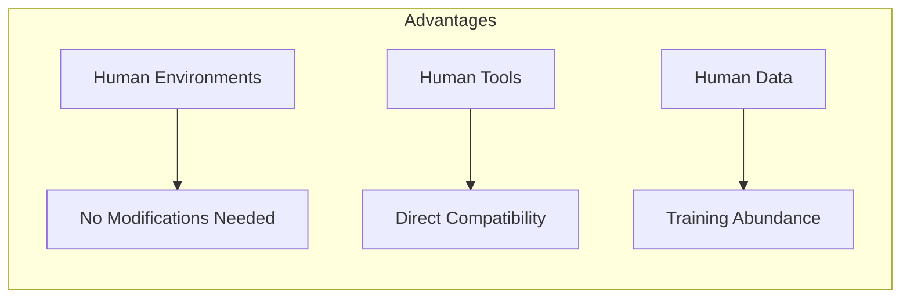
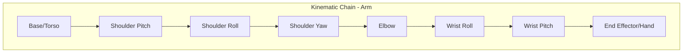
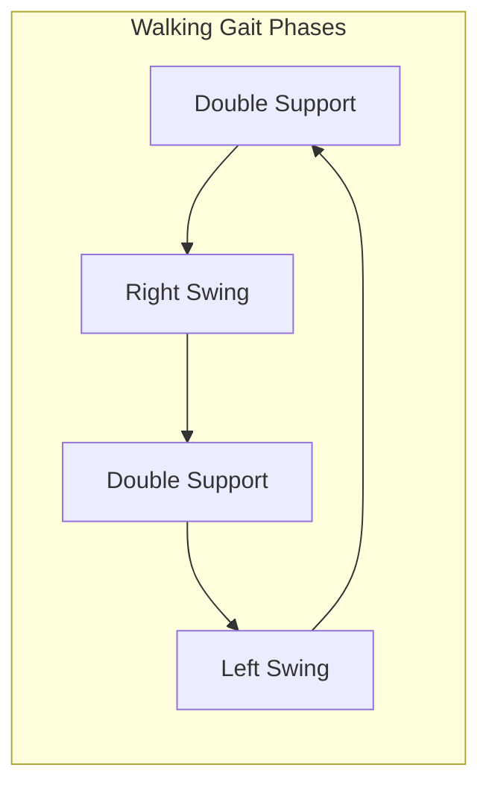

# Weeks 11-12: Humanoid Robot Development

> [!IMPORTANT]
> **Focus**: Kinematics, Dynamics, and Locomotion for Bipedal Robots - the most challenging domain in robotics.

## The Challenge of Bipedalism

Unlike wheeled robots, humanoids must constantly fight gravity. They are inherently unstable—essentially inverted pendulums that must be actively controlled. This chapter covers the physics and control strategies required to keep them upright and moving.

### Why Humanoids?



| Robot Type | Environment Adaptation | Tool Use | Training Data |
|------------|----------------------|----------|---------------|
| Wheeled | Requires ramps, smooth floors | Limited | Sparse |
| Quadruped | Better terrain handling | Minimal | Moderate |
| **Humanoid** | Built for human spaces | Full compatibility | Abundant |

---

## 1. Humanoid Kinematics

### Forward Kinematics

Forward kinematics calculates the end-effector position (hand, foot) given all joint angles. For a humanoid, this involves a kinematic chain from base to end-effector.



```python
import numpy as np
from scipy.spatial.transform import Rotation

class HumanoidKinematics:
    """
    Forward and Inverse Kinematics for humanoid robots.
    Uses Denavit-Hartenberg (DH) convention.
    """
    
    def __init__(self, urdf_path: str = None):
        # DH parameters for a 7-DOF arm
        # Format: [a, alpha, d, theta_offset]
        self.dh_params = [
            [0, -np.pi/2, 0.1, 0],      # Shoulder pitch
            [0, np.pi/2, 0, 0],          # Shoulder roll
            [0, -np.pi/2, 0.3, 0],       # Shoulder yaw
            [0, np.pi/2, 0, 0],          # Elbow
            [0, -np.pi/2, 0.25, 0],      # Wrist roll
            [0, np.pi/2, 0, 0],          # Wrist pitch
            [0, 0, 0.1, 0],              # Wrist yaw
        ]
    
    def dh_matrix(self, a, alpha, d, theta):
        """Create DH transformation matrix."""
        ct, st = np.cos(theta), np.sin(theta)
        ca, sa = np.cos(alpha), np.sin(alpha)
        
        return np.array([
            [ct, -st*ca, st*sa, a*ct],
            [st, ct*ca, -ct*sa, a*st],
            [0, sa, ca, d],
            [0, 0, 0, 1]
        ])
    
    def forward_kinematics(self, joint_angles: list) -> np.ndarray:
        """
        Calculate end-effector pose given joint angles.
        
        Args:
            joint_angles: List of 7 joint angles in radians
            
        Returns:
            4x4 transformation matrix of end-effector
        """
        T = np.eye(4)  # Start with identity
        
        for i, (dh, theta) in enumerate(zip(self.dh_params, joint_angles)):
            a, alpha, d, theta_offset = dh
            T_i = self.dh_matrix(a, alpha, d, theta + theta_offset)
            T = T @ T_i
        
        return T
    
    def get_position(self, joint_angles: list) -> np.ndarray:
        """Get end-effector XYZ position."""
        T = self.forward_kinematics(joint_angles)
        return T[:3, 3]
    
    def get_orientation(self, joint_angles: list) -> Rotation:
        """Get end-effector orientation as rotation object."""
        T = self.forward_kinematics(joint_angles)
        return Rotation.from_matrix(T[:3, :3])


# Example usage
kinematics = HumanoidKinematics()
angles = [0.0, 0.5, 0.0, -1.0, 0.0, 0.5, 0.0]  # 7 joint angles
position = kinematics.get_position(angles)
print(f"End effector position: {position}")
```

### Inverse Kinematics (IK)

Inverse kinematics solves the opposite problem: given a desired end-effector position, find the joint angles. This is significantly harder because:
- Multiple solutions may exist
- No solution may exist (target out of reach)
- The problem is nonlinear

```python
from scipy.optimize import minimize

class InverseKinematics:
    """
    Numerical Inverse Kinematics solver using optimization.
    """
    
    def __init__(self, kinematics: HumanoidKinematics):
        self.fk = kinematics
        self.num_joints = 7
        
        # Joint limits (radians)
        self.joint_limits = [
            (-2.0, 2.0),    # Shoulder pitch
            (-1.5, 1.5),    # Shoulder roll
            (-2.0, 2.0),    # Shoulder yaw
            (-2.5, 0.0),    # Elbow (only bends one way)
            (-2.0, 2.0),    # Wrist roll
            (-1.5, 1.5),    # Wrist pitch
            (-2.0, 2.0),    # Wrist yaw
        ]
    
    def solve(self, target_position: np.ndarray, 
              initial_guess: np.ndarray = None) -> np.ndarray:
        """
        Solve IK for target position.
        
        Args:
            target_position: Desired [x, y, z] position
            initial_guess: Starting joint configuration
            
        Returns:
            Joint angles that achieve target position
        """
        if initial_guess is None:
            initial_guess = np.zeros(self.num_joints)
        
        def cost_function(angles):
            current_pos = self.fk.get_position(angles)
            error = np.linalg.norm(current_pos - target_position)
            return error
        
        result = minimize(
            cost_function,
            initial_guess,
            method='SLSQP',
            bounds=self.joint_limits,
            options={'ftol': 1e-6, 'maxiter': 100}
        )
        
        return result.x


# Example: Reach for a target
ik_solver = InverseKinematics(kinematics)
target = np.array([0.4, 0.2, 0.3])  # Target position
solution = ik_solver.solve(target)
print(f"Solution joint angles: {solution}")
```

---

## 2. Humanoid Dynamics

Dynamics deals with forces and torques. For humanoids, this is critical for:
- Computing required motor torques
- Predicting how the robot will move
- Maintaining balance

### The Equations of Motion

```python
class HumanoidDynamics:
    """
    Rigid body dynamics for humanoid robots.
    Implements Newton-Euler formulation.
    """
    
    def __init__(self, urdf_path: str):
        # Link masses (kg)
        self.masses = {
            'torso': 15.0,
            'upper_arm': 2.0,
            'lower_arm': 1.5,
            'thigh': 5.0,
            'shin': 3.0,
            'foot': 1.0
        }
        
        # Inertia tensors (simplified as scalars)
        self.inertias = {
            'torso': 0.5,
            'thigh': 0.1,
            'shin': 0.05,
            'foot': 0.02
        }
    
    def compute_com(self, joint_positions: dict) -> np.ndarray:
        """
        Compute Center of Mass of the entire robot.
        
        Args:
            joint_positions: Dict mapping joint names to positions
            
        Returns:
            3D position of center of mass
        """
        total_mass = sum(self.masses.values())
        com = np.zeros(3)
        
        for link, mass in self.masses.items():
            # Get link position from FK (simplified)
            link_pos = self._get_link_position(link, joint_positions)
            com += mass * link_pos
        
        return com / total_mass
    
    def compute_required_torques(self, joint_angles: list, 
                                  joint_velocities: list,
                                  joint_accelerations: list) -> list:
        """
        Compute required joint torques using inverse dynamics.
        τ = M(q)q̈ + C(q,q̇)q̇ + G(q)
        """
        # Simplified version - full implementation uses Recursive Newton-Euler
        gravity_torques = self._compute_gravity_compensation(joint_angles)
        inertia_torques = self._compute_inertia_effects(
            joint_angles, joint_accelerations
        )
        coriolis_torques = self._compute_coriolis(
            joint_angles, joint_velocities
        )
        
        return gravity_torques + inertia_torques + coriolis_torques
    
    def _get_link_position(self, link: str, joints: dict) -> np.ndarray:
        # Placeholder - use FK in practice
        return np.array([0.0, 0.0, 0.5])
    
    def _compute_gravity_compensation(self, angles: list) -> np.ndarray:
        # Placeholder for gravity compensation
        return np.zeros(len(angles))
    
    def _compute_inertia_effects(self, angles, accels) -> np.ndarray:
        return np.zeros(len(angles))
    
    def _compute_coriolis(self, angles, vels) -> np.ndarray:
        return np.zeros(len(angles))
```

---

## 3. Bipedal Locomotion and Balance

Walking is essentially **"controlled falling."** The robot shifts its Center of Mass (CoM) forward and catches itself with the swing leg.

### Zero Moment Point (ZMP)

The key to bipedal balance. The ZMP is the point on the ground where the net moment of inertia and gravity forces is zero.

> [!WARNING]
> If the ZMP leaves the support polygon (area under the feet), the robot will fall!

```python
class BalanceController:
    """
    ZMP-based balance controller for bipedal locomotion.
    """
    
    def __init__(self):
        self.foot_length = 0.25  # meters
        self.foot_width = 0.10
        
    def compute_zmp(self, com_position: np.ndarray, 
                    com_acceleration: np.ndarray,
                    robot_mass: float,
                    gravity: float = 9.81) -> np.ndarray:
        """
        Compute Zero Moment Point.
        
        ZMP_x = CoM_x - (CoM_z / g) * a_x
        ZMP_y = CoM_y - (CoM_z / g) * a_y
        """
        zmp_x = com_position[0] - (com_position[2] / gravity) * com_acceleration[0]
        zmp_y = com_position[1] - (com_position[2] / gravity) * com_acceleration[1]
        
        return np.array([zmp_x, zmp_y])
    
    def get_support_polygon(self, stance_foot: str, 
                            foot_position: np.ndarray) -> list:
        """
        Get vertices of support polygon for current stance.
        """
        half_l = self.foot_length / 2
        half_w = self.foot_width / 2
        x, y = foot_position[0], foot_position[1]
        
        if stance_foot == "single":
            # Single foot support
            return [
                [x - half_l, y - half_w],
                [x + half_l, y - half_w],
                [x + half_l, y + half_w],
                [x - half_l, y + half_w]
            ]
        else:
            # Double support - larger polygon
            return [
                [x - half_l - 0.1, y - half_w - 0.15],
                [x + half_l + 0.1, y - half_w - 0.15],
                [x + half_l + 0.1, y + half_w + 0.15],
                [x - half_l - 0.1, y + half_w + 0.15]
            ]
    
    def is_balanced(self, zmp: np.ndarray, 
                    support_polygon: list) -> bool:
        """
        Check if ZMP is within support polygon.
        Uses ray casting algorithm.
        """
        from shapely.geometry import Point, Polygon
        
        poly = Polygon(support_polygon)
        point = Point(zmp[0], zmp[1])
        
        return poly.contains(point)
    
    def compute_balance_correction(self, zmp: np.ndarray,
                                     target_zmp: np.ndarray) -> dict:
        """
        Compute corrective actions to maintain balance.
        """
        error = target_zmp - zmp
        
        # PD controller gains
        Kp = 100.0
        Kd = 20.0
        
        correction = {
            'hip_pitch_adjustment': Kp * error[0],
            'ankle_pitch_adjustment': Kp * error[0],
            'hip_roll_adjustment': Kp * error[1],
            'ankle_roll_adjustment': Kp * error[1]
        }
        
        return correction
```

### Gait Generation



```python
class GaitGenerator:
    """
    Generates walking trajectories for bipedal robots.
    """
    
    def __init__(self):
        self.step_length = 0.3  # meters
        self.step_height = 0.05
        self.step_duration = 0.8  # seconds
        self.double_support_ratio = 0.2
        
    def generate_foot_trajectory(self, t: float, 
                                  start_pos: np.ndarray,
                                  end_pos: np.ndarray) -> np.ndarray:
        """
        Generate swing foot trajectory using cubic splines.
        """
        # Normalize time to [0, 1]
        s = min(t / self.step_duration, 1.0)
        
        # X-Y: Linear interpolation
        xy = start_pos[:2] + s * (end_pos[:2] - start_pos[:2])
        
        # Z: Parabolic trajectory for foot clearance
        z = start_pos[2] + 4 * self.step_height * s * (1 - s)
        
        return np.array([xy[0], xy[1], z])
    
    def generate_walking_pattern(self, num_steps: int,
                                  direction: np.ndarray) -> list:
        """
        Generate complete walking pattern.
        
        Returns:
            List of (foot, target_position, timing) tuples
        """
        pattern = []
        current_pos = {'left': np.array([0, 0.1, 0]), 
                      'right': np.array([0, -0.1, 0])}
        
        for i in range(num_steps):
            # Alternate feet
            swing_foot = 'left' if i % 2 == 0 else 'right'
            
            # Compute target position
            target = current_pos[swing_foot] + direction * self.step_length
            
            pattern.append({
                'foot': swing_foot,
                'start': current_pos[swing_foot].copy(),
                'target': target,
                'start_time': i * self.step_duration,
                'duration': self.step_duration
            })
            
            current_pos[swing_foot] = target
        
        return pattern
```

---

## 4. Humanoid Hands and Manipulation

### Gripper Types

| Type | DOF | Use Case | Complexity |
|------|-----|----------|------------|
| Parallel Gripper | 1 | Pick-and-place | Low |
| 3-Finger Gripper | 3-4 | General manipulation | Medium |
| Dexterous Hand | 15-20 | Fine manipulation | High |

```python
class HumanoidGripper:
    """
    Controller for humanoid hand/gripper.
    """
    
    def __init__(self, gripper_type: str = "parallel"):
        self.gripper_type = gripper_type
        self.max_force = 50.0  # Newtons
        self.finger_positions = [0.0, 0.0]  # For parallel gripper
        
    def grasp(self, target_force: float = 10.0) -> bool:
        """
        Execute grasping motion with force control.
        """
        # Close fingers until force threshold or contact
        while self.get_gripper_force() < target_force:
            self.close_increment(0.01)  # 1cm increments
            
            if self.detect_contact():
                break
        
        return self.is_object_grasped()
    
    def release(self):
        """Open gripper fully."""
        self.finger_positions = [1.0, 1.0]  # Fully open
        
    def close_increment(self, amount: float):
        self.finger_positions = [
            max(0, p - amount) for p in self.finger_positions
        ]
    
    def get_gripper_force(self) -> float:
        # Read from force sensors
        return 0.0
    
    def detect_contact(self) -> bool:
        # Check contact sensors
        return False
    
    def is_object_grasped(self) -> bool:
        return self.get_gripper_force() > 2.0  # Minimum grasp force
```

### Visual Servoing

Using camera feedback to guide manipulation:

```python
class VisualServoing:
    """
    Use visual feedback to guide end-effector to target.
    """
    
    def __init__(self):
        self.Kp = 0.5  # Proportional gain
        self.error_threshold = 0.01  # 1cm
        
    def compute_velocity_command(self, 
                                  current_image_point: tuple,
                                  target_image_point: tuple,
                                  depth: float) -> np.ndarray:
        """
        Image-Based Visual Servoing (IBVS).
        Computes end-effector velocity from image error.
        """
        # Image error
        error_u = target_image_point[0] - current_image_point[0]
        error_v = target_image_point[1] - current_image_point[1]
        
        # Convert to Cartesian velocity (simplified)
        vx = self.Kp * error_u * depth / 500  # fx approximation
        vy = self.Kp * error_v * depth / 500
        vz = 0  # Maintain depth
        
        return np.array([vx, vy, vz])
    
    def servo_to_target(self, vision_system, target_object: str):
        """
        Complete visual servoing loop.
        """
        while True:
            # Detect target in image
            detection = vision_system.detect_object(target_object)
            
            if detection is None:
                print("Target lost!")
                return False
            
            # Compute and apply velocity
            velocity = self.compute_velocity_command(
                detection['center'],
                (320, 240),  # Image center
                detection['depth']
            )
            
            # Check convergence
            if np.linalg.norm(velocity) < self.error_threshold:
                print("Target reached!")
                return True
            
            # Send velocity command to robot
            # robot.set_ee_velocity(velocity)
```

---

## Summary

This chapter covered the fundamentals of humanoid robot development:

| Topic | Key Concept | Application |
|-------|-------------|-------------|
| **Kinematics** | FK/IK transformations | Reaching targets |
| **Dynamics** | Forces and torques | Motor control |
| **Balance** | ZMP control | Staying upright |
| **Locomotion** | Gait generation | Walking |
| **Manipulation** | Grasping strategies | Object handling |

> [!TIP]
> For the Capstone project, we will focus on **pick-and-place** tasks using the Unitree G1 or a simulated equivalent in Isaac Sim. Understanding these fundamentals is essential for that integration.

## Next Steps

In **Chapter 5: Capstone Project**, you'll integrate everything—VLA, navigation, and manipulation—into a complete autonomous humanoid system.
