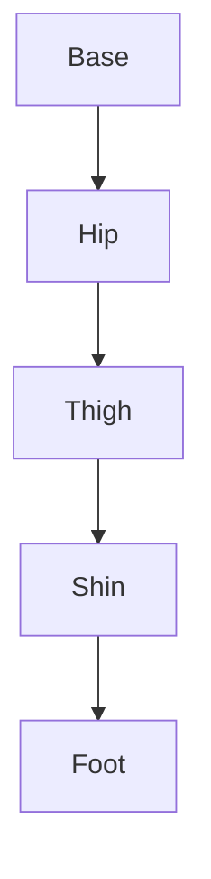

# Weeks 11-12: Humanoid Robot Development

::info
**Focus**: Kinematics, Dynamics, and Locomotion for Bipedal Robots.
::

## The Challenge of Bipedalism

Unlike wheeled robots, humanoids must constantly fight gravity. They are inherently unstable. This chapter covers the physics and control strategies required to keep them upright and moving.

## 1. Kinematics and Dynamics

*   **Forward Kinematics**: Calculating where the hand is based on joint angles.
*   **Inverse Kinematics (IK)**: Calculating joint angles to reach a specific hand position.
*   **Dynamics**: Analyzing forces and torques (mass, inertia) to ensure smooth movement.

### The URDF Model
As discussed in Chapter 1, the URDF defines the robot's body. For humanoids, this includes precise mass and inertia matrices for every link (thigh, shin, foot).



## 2. Bipedal Locomotion and Balance

Walking is essentially "controlled falling." The robot shifts its Center of Mass (CoM) forward and catches itself with the swing leg.

### Zero Moment Point (ZMP)
To stay balanced, the robot must keep its **Zero Moment Point** within the support polygon (the area covered by its feet). If the ZMP leaves this area, the robot falls.

<details>
<summary>Show ZMP Calculation Logic</summary>

```python
def calculate_zmp(forces, torques):
    # Simplified logic
    # ZMP_x = (Torque_y + Force_z * p_x) / Force_z
    pass
```
</details>

## 3. Manipulation with Humanoid Hands

Humanoid hands range from simple grippers to multi-fingered dexterous hands.

*   **Grasping Strategies**: Power grasp vs. Pinch grasp.
*   **Visual Servoing**: Using camera feedback to guide the hand to the object.

::note
For the Capstone, we will focus on **pick-and-place** tasks using the Unitree G1 or a simulated equivalent in Isaac Sim.
::
