# Week 13: Conversational Robotics

> [!IMPORTANT]
> **Focus**: Integrating GPT models for natural, multi-modal human-robot interaction.

## Beyond Commands: Conversation

A truly intelligent robot shouldn't just take orders; it should **converse**. It should:
- Ask clarifying questions ("Which red ball?")
- Explain its actions ("I'm moving the chair to clean behind it")
- Provide information about its state and capabilities
- Understand context and maintain memory across interactions


---

## 1. Integrating GPT Models for Robot Conversation

### The Conversational Robot Architecture

```mermaid
graph LR
    subgraph Input
        A[🎤 Microphone] --> B[Whisper STT]
        C[📷 Camera] --> D[Vision]
    end
    
    subgraph Processing
        B --> E[Context Manager]
        D --> E
        E --> F[GPT-4 Dialogue]
        F --> G[Action Parser]
    end
    
    subgraph Output
        G --> H[ROS 2 Actions]
        F --> I[TTS Engine]
        I --> J[🔊 Speaker]
    end
```



### Building a Conversational Robot Agent

```python
from openai import OpenAI
from typing import List, Dict, Optional
from dataclasses import dataclass
import json

@dataclass
class RobotState:
    """Current state of the robot for context."""
    position: tuple
    holding_object: Optional[str]
    visible_objects: List[str]
    battery_level: float
    is_moving: bool

class ConversationalRobot:
    """
    GPT-powered conversational interface for humanoid robots.
    Maintains dialogue history and robot state awareness.
    """
    
    SYSTEM_PROMPT = """You are a helpful, safety-conscious humanoid robot assistant named Atlas.
Your personality: Friendly, patient, and informative.

Current capabilities:
- Navigation: Move to locations in the environment
- Manipulation: Pick up and place objects
- Vision: Identify objects and people
- Speech: Communicate verbally

Safety rules:
1. NEVER perform actions that could harm humans
2. Always ask for clarification if a command is ambiguous
3. Explain what you're doing and why
4. Stop immediately if someone says "stop" or "halt"

When responding:
- Keep responses concise (1-3 sentences for normal interaction)
- If you need to perform an action, output it as JSON in <action> tags
- Acknowledge commands before executing them
- Ask clarifying questions when needed

Available actions for <action> tags:
{"type": "move_to", "target": "location_name"}
{"type": "pick_up", "object": "object_name"}
{"type": "place", "object": "object_name", "location": "location_name"}
{"type": "look_at", "target": "target_name"}
{"type": "wait", "duration": seconds}
"""

    def __init__(self):
        self.client = OpenAI()
        self.conversation_history: List[Dict] = []
        self.robot_state = RobotState(
            position=(0, 0, 0),
            holding_object=None,
            visible_objects=["table", "chair", "coffee_cup", "water_bottle"],
            battery_level=85.0,
            is_moving=False
        )
        self.max_history = 20  # Keep last 20 exchanges
        
    def _build_context_message(self) -> str:
        """Build context message with current robot state."""
        return f"""[ROBOT STATE]
Position: {self.robot_state.position}
Holding: {self.robot_state.holding_object or 'Nothing'}
Visible objects: {', '.join(self.robot_state.visible_objects)}
Battery: {self.robot_state.battery_level}%
Moving: {self.robot_state.is_moving}"""

    def chat(self, user_message: str) -> Dict:
        """
        Process user message and generate response with optional actions.
        
        Returns:
            Dict with 'response' (text) and 'actions' (list of action dicts)
        """
        # Add context to conversation
        context = self._build_context_message()
        
        # Add user message to history
        self.conversation_history.append({
            "role": "user",
            "content": f"{context}\n\nHuman: {user_message}"
        })
        
        # Trim history if needed
        if len(self.conversation_history) > self.max_history:
            self.conversation_history = self.conversation_history[-self.max_history:]
        
        # Call GPT
        messages = [{"role": "system", "content": self.SYSTEM_PROMPT}]
        messages.extend(self.conversation_history)
        
        response = self.client.chat.completions.create(
            model="gpt-4o-mini",
            messages=messages,
            temperature=0.7,
            max_tokens=300
        )
        
        assistant_message = response.choices[0].message.content
        
        # Add assistant response to history
        self.conversation_history.append({
            "role": "assistant",
            "content": assistant_message
        })
        
        # Parse any actions from the response
        actions = self._parse_actions(assistant_message)
        clean_response = self._clean_response(assistant_message)
        
        return {
            "response": clean_response,
            "actions": actions
        }
    
    def _parse_actions(self, message: str) -> List[Dict]:
        """Extract action JSON from <action> tags."""
        actions = []
        import re
        
        pattern = r'<action>(.*?)</action>'
        matches = re.findall(pattern, message, re.DOTALL)
        
        for match in matches:
            try:
                action = json.loads(match.strip())
                actions.append(action)
            except json.JSONDecodeError:
                pass
        
        return actions
    
    def _clean_response(self, message: str) -> str:
        """Remove action tags from response for speech output."""
        import re
        return re.sub(r'<action>.*?</action>', '', message, flags=re.DOTALL).strip()
    
    def update_state(self, **kwargs):
        """Update robot state from sensors/actuators."""
        for key, value in kwargs.items():
            if hasattr(self.robot_state, key):
                setattr(self.robot_state, key, value)


# Usage Example
if __name__ == "__main__":
    robot = ConversationalRobot()
    
    # Simulated conversation
    exchanges = [
        "Hello! What can you do?",
        "Can you get me something to drink?",
        "Coffee please",
        "Actually, put it on the table near the window"
    ]
    
    for message in exchanges:
        print(f"\n👤 Human: {message}")
        result = robot.chat(message)
        print(f"🤖 Robot: {result['response']}")
        if result['actions']:
            print(f"   Actions: {result['actions']}")
```

### Context Management and Memory

Robots need memory to understand references and maintain coherent dialogue:

```python
class ConversationMemory:
    """
    Long-term and short-term memory for robot conversations.
    """
    
    def __init__(self):
        self.short_term = []  # Current session
        self.long_term = {}   # Persistent facts
        self.entities = {}    # Referenced objects/people
        
    def add_utterance(self, role: str, content: str):
        """Add utterance to short-term memory."""
        self.short_term.append({
            "role": role,
            "content": content,
            "timestamp": time.time()
        })
        
        # Extract and track entities
        self._extract_entities(content)
    
    def _extract_entities(self, text: str):
        """Extract entities for reference resolution."""
        # Simple entity extraction (use SpaCy for production)
        import re
        
        # Track "the X" patterns
        pattern = r'the (\w+)'
        matches = re.findall(pattern, text.lower())
        
        for match in matches:
            self.entities[match] = {
                "last_mentioned": time.time(),
                "context": text
            }
    
    def resolve_reference(self, pronoun: str) -> Optional[str]:
        """
        Resolve pronouns like 'it', 'that', 'this'.
        Returns the most recently mentioned relevant entity.
        """
        if pronoun in ['it', 'that', 'this']:
            # Return most recently mentioned object
            if self.entities:
                recent = max(self.entities.items(), 
                           key=lambda x: x[1]['last_mentioned'])
                return recent[0]
        return None
    
    def get_context_summary(self, max_tokens: int = 500) -> str:
        """Generate summary of conversation context."""
        # For long conversations, summarize older parts
        recent = self.short_term[-10:]  # Last 10 utterances
        
        context = "Recent conversation:\n"
        for item in recent:
            role = "Human" if item["role"] == "user" else "Robot"
            context += f"- {role}: {item['content'][:100]}...\n"
        
        return context
```

---

## 2. Speech Recognition (STT) and Synthesis (TTS)

### Speech-to-Text with Whisper

```python
from openai import OpenAI
import pyaudio
import wave
import numpy as np

class SpeechRecognition:
    """
    Real-time speech recognition using OpenAI Whisper.
    Includes voice activity detection for natural conversation.
    """
    
    def __init__(self):
        self.client = OpenAI()
        self.sample_rate = 16000
        self.channels = 1
        self.chunk_size = 1024
        self.silence_threshold = 500
        self.silence_duration = 1.5  # seconds
        
    def listen_with_vad(self) -> str:
        """
        Listen with Voice Activity Detection.
        Automatically detects when speech starts and ends.
        """
        p = pyaudio.PyAudio()
        stream = p.open(
            format=pyaudio.paInt16,
            channels=self.channels,
            rate=self.sample_rate,
            input=True,
            frames_per_buffer=self.chunk_size
        )
        
        print("🎤 Listening... (speak now)")
        
        frames = []
        silent_chunks = 0
        speaking = False
        
        while True:
            data = stream.read(self.chunk_size)
            audio_data = np.frombuffer(data, dtype=np.int16)
            volume = np.abs(audio_data).mean()
            
            if volume > self.silence_threshold:
                speaking = True
                silent_chunks = 0
                frames.append(data)
            elif speaking:
                frames.append(data)
                silent_chunks += 1
                
                # Stop after silence duration
                if silent_chunks > (self.silence_duration * self.sample_rate / self.chunk_size):
                    break
        
        stream.stop_stream()
        stream.close()
        p.terminate()
        
        # Save and transcribe
        return self._transcribe_frames(frames)
    
    def _transcribe_frames(self, frames: list) -> str:
        """Transcribe audio frames using Whisper."""
        import tempfile
        
        with tempfile.NamedTemporaryFile(suffix=".wav", delete=False) as f:
            wf = wave.open(f.name, 'wb')
            wf.setnchannels(self.channels)
            wf.setsampwidth(2)  # 16-bit
            wf.setframerate(self.sample_rate)
            wf.writeframes(b''.join(frames))
            wf.close()
            
            with open(f.name, "rb") as audio:
                transcript = self.client.audio.transcriptions.create(
                    model="whisper-1",
                    file=audio
                )
            
            return transcript.text
```

### Text-to-Speech with OpenAI

```python
class SpeechSynthesis:
    """
    Text-to-Speech using OpenAI's TTS model.
    """
    
    def __init__(self, voice: str = "alloy"):
        self.client = OpenAI()
        self.voice = voice  # alloy, echo, fable, onyx, nova, shimmer
        
    def speak(self, text: str) -> bytes:
        """
        Convert text to speech audio.
        
        Returns:
            Audio bytes in MP3 format
        """
        response = self.client.audio.speech.create(
            model="tts-1",
            voice=self.voice,
            input=text
        )
        
        return response.content
    
    def speak_and_play(self, text: str):
        """Speak text through speakers."""
        import io
        from pydub import AudioSegment
        from pydub.playback import play
        
        audio_bytes = self.speak(text)
        audio = AudioSegment.from_mp3(io.BytesIO(audio_bytes))
        play(audio)
    
    async def stream_speak(self, text: str):
        """Stream audio for lower latency."""
        response = self.client.audio.speech.create(
            model="tts-1",
            voice=self.voice,
            input=text,
            response_format="pcm"  # Raw audio for streaming
        )
        
        # Stream to audio device
        # Implementation depends on audio library
        return response.content
```

---

## 3. Multi-Modal Interaction

Humans communicate with more than just words. Robots must understand **gestures**, **gaze**, and **context**.

### Multi-Modal Fusion


```python
from dataclasses import dataclass
from enum import Enum
from typing import Optional, List
import numpy as np

class Modality(Enum):
    SPEECH = "speech"
    GESTURE = "gesture"
    GAZE = "gaze"
    TOUCH = "touch"

@dataclass
class ModalityInput:
    modality: Modality
    data: any
    confidence: float
    timestamp: float

class MultiModalFusion:
    """
    Fuse inputs from multiple modalities to understand user intent.
    """
    
    def __init__(self):
        self.modality_weights = {
            Modality.SPEECH: 0.4,
            Modality.GESTURE: 0.3,
            Modality.GAZE: 0.2,
            Modality.TOUCH: 0.1
        }
        self.input_buffer: List[ModalityInput] = []
        self.fusion_window = 2.0  # seconds
        
    def add_input(self, modality: Modality, data: any, confidence: float):
        """Add input from a modality."""
        import time
        self.input_buffer.append(ModalityInput(
            modality=modality,
            data=data,
            confidence=confidence,
            timestamp=time.time()
        ))
        
        # Clean old inputs
        self._clean_buffer()
    
    def _clean_buffer(self):
        """Remove inputs outside fusion window."""
        import time
        current_time = time.time()
        self.input_buffer = [
            inp for inp in self.input_buffer
            if current_time - inp.timestamp < self.fusion_window
        ]
    
    def fuse_and_interpret(self) -> dict:
        """
        Fuse all current inputs and interpret intent.
        """
        if not self.input_buffer:
            return {"intent": None, "confidence": 0}
        
        # Group inputs by modality
        grouped = {}
        for inp in self.input_buffer:
            if inp.modality not in grouped:
                grouped[inp.modality] = []
            grouped[inp.modality].append(inp)
        
        # Extract features from each modality
        features = {}
        
        if Modality.SPEECH in grouped:
            speech_input = max(grouped[Modality.SPEECH], key=lambda x: x.confidence)
            features['speech_text'] = speech_input.data
            features['speech_confidence'] = speech_input.confidence
        
        if Modality.GESTURE in grouped:
            gesture_input = max(grouped[Modality.GESTURE], key=lambda x: x.confidence)
            features['gesture_type'] = gesture_input.data
            
        if Modality.GAZE in grouped:
            gaze_input = grouped[Modality.GAZE][-1]  # Most recent
            features['gaze_target'] = gaze_input.data
        
        # Interpret combined intent
        return self._interpret_intent(features)
    
    def _interpret_intent(self, features: dict) -> dict:
        """Interpret user intent from fused features."""
        
        speech_text = features.get('speech_text', '').lower()
        gesture = features.get('gesture_type')
        gaze = features.get('gaze_target')
        
        # Rule-based fusion (could be replaced with ML model)
        if 'come' in speech_text and gesture == 'waving':
            return {
                "intent": "approach_person",
                "confidence": 0.95,
                "target": gaze
            }
        
        if 'that' in speech_text or 'this' in speech_text:
            # Resolve deixis using gaze
            return {
                "intent": "reference_object",
                "confidence": 0.85,
                "target": gaze
            }
        
        if gesture == 'pointing':
            return {
                "intent": "attention_to_location",
                "confidence": 0.8,
                "target": gaze
            }
        
        # Default: speech only
        return {
            "intent": "speech_command",
            "confidence": features.get('speech_confidence', 0.5),
            "text": speech_text
        }


# Example usage
fusion = MultiModalFusion()
fusion.add_input(Modality.SPEECH, "Come here please", confidence=0.9)
fusion.add_input(Modality.GESTURE, "waving", confidence=0.85)
fusion.add_input(Modality.GAZE, "robot", confidence=0.7)

result = fusion.fuse_and_interpret()
print(f"Intent: {result}")
```

---

## 4. Complete Conversational Robot System

### Bringing It All Together

```python
class ConversationalRobotSystem:
    """
    Complete conversational robot system integrating
    speech, vision, dialogue, and action.
    """
    
    def __init__(self):
        self.stt = SpeechRecognition()
        self.tts = SpeechSynthesis(voice="nova")
        self.dialogue = ConversationalRobot()
        self.fusion = MultiModalFusion()
        self.running = False
        
    def run_interaction_loop(self):
        """Main interaction loop."""
        self.running = True
        self.tts.speak_and_play("Hello! I'm Atlas, your robot assistant. How can I help you?")
        
        while self.running:
            # Listen for speech
            user_speech = self.stt.listen_with_vad()
            
            if not user_speech:
                continue
                
            print(f"👤 You said: {user_speech}")
            
            # Check for exit command
            if any(word in user_speech.lower() for word in ['goodbye', 'bye', 'exit']):
                self.tts.speak_and_play("Goodbye! Have a great day!")
                self.running = False
                break
            
            # Get robot response
            result = self.dialogue.chat(user_speech)
            
            # Speak response
            print(f"🤖 Atlas: {result['response']}")
            self.tts.speak_and_play(result['response'])
            
            # Execute any actions
            for action in result['actions']:
                self._execute_action(action)
    
    def _execute_action(self, action: dict):
        """Execute parsed action on robot."""
        action_type = action.get('type')
        
        print(f"   ⚡ Executing: {action}")
        
        # In practice, send to ROS 2
        # self.ros_bridge.execute(action)


# Run the system
if __name__ == "__main__":
    robot = ConversationalRobotSystem()
    robot.run_interaction_loop()
```

---

## Summary

This chapter covered the foundations of conversational robotics:

| Component | Technology | Purpose |
|-----------|------------|---------|
| **Dialogue** | GPT-4 / LLMs | Natural conversation |
| **STT** | OpenAI Whisper | Speech recognition |
| **TTS** | OpenAI TTS | Speech synthesis |
| **Memory** | Context buffers | Conversation continuity |
| **Multi-Modal** | Sensor fusion | Rich interaction |

> [!TIP]
> **Key Insight**: Conversational robots are not just about understanding words—they must understand **intent** through multiple channels and maintain **context** over time.

> [!SUCCESS]
> **Congratulations!** You have now covered the theoretical and software foundations of Physical AI. In the next chapter, you'll implement the RAG chatbot that powers this very textbook!

## Next Steps

Continue to **Chapter 6: RAG Implementation** to learn how to build the AI chatbot that makes this textbook interactive.
